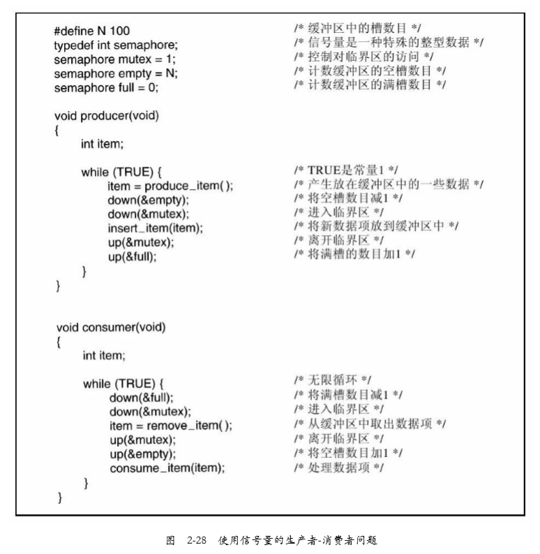

# 信号量

信号量是E.W.Dijkstra在1965年提出的一种方法，它使用一个整型变量来累计唤醒次数，供以后使用。 

他的建议中引入了一个新的变量类型，称作信号量（semaphore）。 

一个信号量的取值可以为0（表示没有保存下来的唤醒操作）或者为正值（表示有一个或多个唤醒操作）。

Dijkstra建议设立两种操作：down和up（分别为一般化后的sleep和wakeup）

​		对一信号量执行down操 作，则是检查其值是否大于0。若该值大于0，则将其值减1（即用掉一个保存的唤醒信号）并继续；若该值 为0，则进程将睡眠，而

且此时down操作并未结束。检查数值、修改变量值以及可能发生的睡眠操作均作为一个单一的、不可分割的原子操作完成。保证一旦一个信号量操作开始，则在

该操作完成或阻塞之前，其他进程均不允许访问该信号量。这种原子性对于解决同步问题和避免竞争条件是绝对必要的。所谓原子操作，是指一组相关联的操作要

么都不间断地执行，要么都不执行。原子操作在计算机科学的其他领域也是非常重要的。up操作对信号量的值增1。如果一个或多个进程在该信号量上睡眠，无法

完成一个先前的down操作，则 由系统选择其中的一个（如随机挑选）并允许该进程完成它的down操作。于是，对一个有进程在其上睡眠 的信号量执行一次up操

作之后，该信号量的值仍旧是0，但在其上睡眠的进程却少了一个。信号量的值增1和 唤醒一个进程同样也是不可分割的。不会有某个进程因执行up而阻塞，正如

在前面的模型中不会有进程因执 行wakeup而阻塞一样。

#### 原子操作

是指一组相关联的操作要么都不间断地执行，要么都不执行。

#### 二元信号量

供两个或多个进程使用的信号量，其初值为1，保证同时只有一个进 程可以进入临界区，称作二元信号量（binary semaphore

**信号量的另一种用途是用于实现同步（synchronization）。信号量full和empty用来保证某种事件的顺序发生或不发生。**

