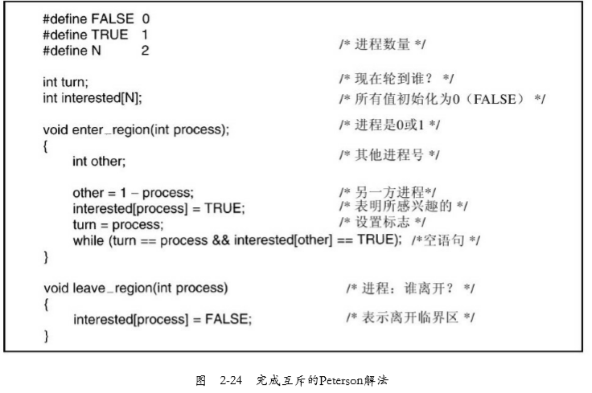
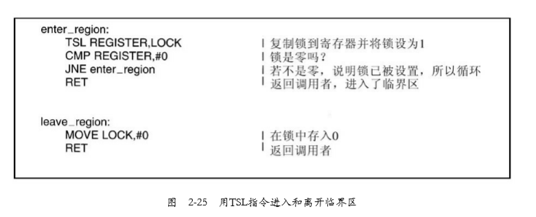
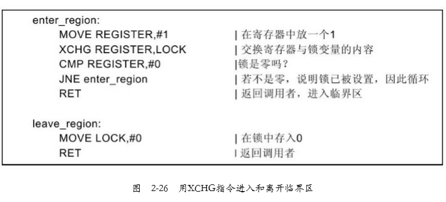

# 进程间的通信

#### 需要考虑三个问题

一个进程如何把信息传递给另一个

确保两个或更多的进程在关键活动中不会出现交叉

正确的顺序有关

#### 竞争条件

即两个或多个进程读写某些共享数据，而最后的结果取决于进程运行的 精确时序，称为竞争条件（race condition）。

#### 临界区

- 对共享内存进行访问的程序片段称作临界区域（critical region）或临界区（critical section）
- 如果我们能够适当地安排，使得两个进程不可能同时处于临界区中，就能够避免竞争条件

#### 怎样避免竞争条件？

关键是要找出某种途径来阻止多个进程同时读写共享的数据。换言之，我们需要的是**互斥**（mutual exclusion），即以某种手段确保当一个进程在使用一个共享变量或文件时，其他进程不能做 同样的操作。

#### 避免了竞争条件的4个条件

1. 任何两个进程不能同时处于其临界区。
2. 不应对CPU的速度和数量做任何假设。
3. 临界区外运行的进程不得阻塞其他进程。
4. 不得使进程无限期等待进入临界区。

#### 实现互斥的方案

##### 1.屏蔽中断

##### 2.锁变量

设想有一个共享（锁）变量，其初始值为0。当一个进 程想进入其临界区时，它首先测试这把锁。如果该锁的值为0，则该进程将其设置为1并进入临界区。若这把 锁的值已经为1，则该进程将等待直到其值变为0。于是，0就表示临界区内没有进程，1表示已经有某个进程
进入临界区。

假设一个进程读出锁变量的值并发现它为0，而恰 好在它将其值设置为1之前，另一个进程被调度运行，将该锁变量设置为1。当第一个进程再次能运行时，它 同样也将该锁设置为1，则此时同时有两个进程进入临界区中

##### 3.严格轮换法

连续测试一个变量直到某个值出现为止，称为忙等待（busy waiting）。 

只有在有理由认为等待时间是非常短的情形下，才使用忙等待。用于忙等待的锁，称为自旋锁（spin lock）

在一个进程比另一个慢了很多的情况下，轮流进入临界区并不是一个好办法，会出现一种现情况：进程0被一个临界区之外的进程阻塞。违反了前面叙述的条件3

##### 4.Peterson解法

##### 5.TSL指令

#### 缺点：

这些解法在本质上是这样的：当一个进程想进入临界区时，先检查是否允许进入，若不允许，则该进程将原地等待，直到允许为止。

